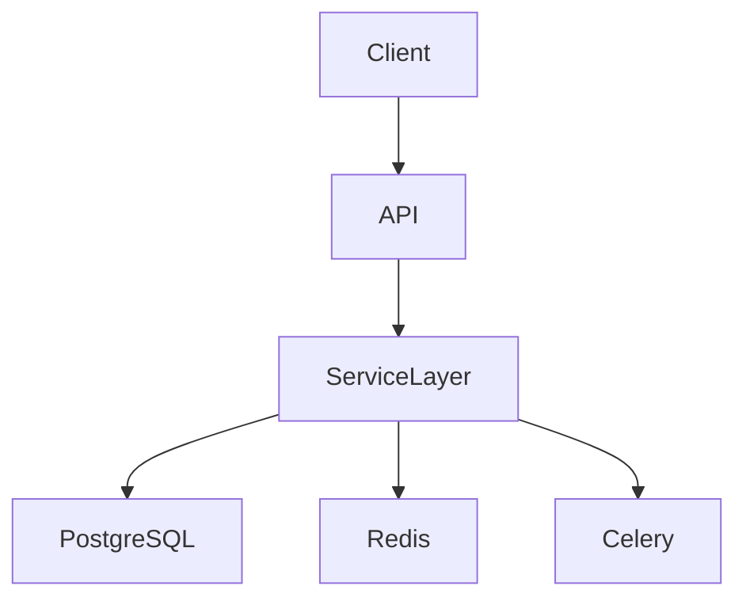
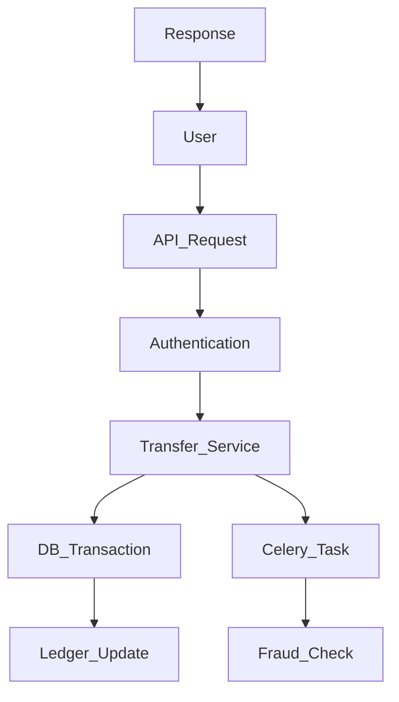

# 🚀 Transaction-Safe Banking Backend

> A production-style banking backend system designed to prevent double spending, ensure data consistency, and handle high-concurrency financial transactions securely.

---

# 📌 Overview

This project is a backend system that simulates real-world banking operations like money transfers while solving critical issues such as race conditions, duplicate transactions, and lack of auditability.

Traditional systems often fail when handling concurrent requests, leading to inconsistent balances or double spending. This system addresses those challenges using database-level locking, atomic transactions, and a ledger-based design.

It is built for developers who want to understand production-grade backend design, especially in fintech systems.

---

# 🎥 Demo / Screenshots

## 🔹 Django Admin Panel


## 🔹 Backend Running (Django Server)


## 🔹 Celery Worker (Async Processing)


## 🔹 JWT Authentication (Postman)


## 🔹 Transfer API (Unauthorized Case)


## 🔹 UUID Generator (Idempotency)


---

# ✨ Features

## Core Features

* Safe money transfer system
* Atomic transactions (no partial updates)
* Row-level locking to prevent race conditions
* Idempotent APIs (no duplicate transactions)
* JWT-based authentication
* Ownership validation (user security)

## Advanced Features

* Redis caching for fast reads
* Celery for async fraud detection
* Ledger-based transaction tracking (immutable)
* Audit logging system
* Scalable service-layer architecture

---

# 🏗 Architecture



---

# 🔄 System Workflow



---

# 🛠 Tech Stack

| Layer       | Technology  |
| ----------- | ----------- |
| Backend     | Django, DRF |
| Database    | PostgreSQL  |
| Cache       | Redis       |
| Async Tasks | Celery      |
| Auth        | JWT         |
| Server      | Gunicorn    |

---

# 📂 Project Structure

```
banking_backend/

├── accounts/
├── transactions/
├── wallets/
├── audits/
├── services/        # Business logic
├── config/
├── tests/
├── manage.py
```

---

# ⚙️ Installation

### 1 Clone the repository

```
git clone https://github.com/yourusername/banking-backend.git
```

### 2 Navigate to project

```
cd banking-backend
```

### 3 Create virtual environment

```
python -m venv venv
venv\Scripts\activate
```

### 4 Install dependencies

```
pip install -r requirements.txt
```

### 5 Run server

```
python manage.py runserver
```

### 6 Start Redis

```
redis-server
```

### 7 Start Celery worker

```
celery -A banking_backend worker --pool=solo --loglevel=info
```

---

# 🔌 API Endpoints

## 🔐 Get JWT Token

```
POST /api/token/
```

Request:

```json
{
  "username": "user1",
  "password": "sampletest1"
}
```

---

## 💸 Transfer Money

```
POST /api/transfer/
```

Request:

```json
{
  "from_account_id": 1,
  "to_account_id": 2,
  "amount": 50,
  "reference_id": "UUID"
}
```

---

# 📊 Performance Considerations

* Redis caching reduces DB load
* Celery prevents API blocking
* Row-level locking ensures consistency
* Idempotency prevents duplicate execution

---

# ⚠️ Challenges Solved

| Problem             | Solution             |
| ------------------- | -------------------- |
| Race conditions     | SELECT FOR UPDATE    |
| Duplicate requests  | Idempotency (UUID)   |
| Slow APIs           | Async processing     |
| Unauthorized access | Ownership validation |
| Data inconsistency  | Atomic transactions  |

---

# 🧠 Key Design Decisions

* Used PostgreSQL for ACID + locking
* Implemented ledger system instead of balance overwrite
* Introduced service layer for clean architecture
* Added async fraud detection to keep API fast

---

# 🗺 Future Improvements

* Docker setup
* API rate limiting
* Monitoring (Prometheus + Grafana)
* Retry mechanism for failed tasks

---

# 👨‍💻 Author

Harsh Verma
GitHub: [https://github.com/harsh-verma-2004](https://github.com/harsh-verma-2004)

---

# ⭐ Support

If you found this useful, consider giving it a star ⭐
